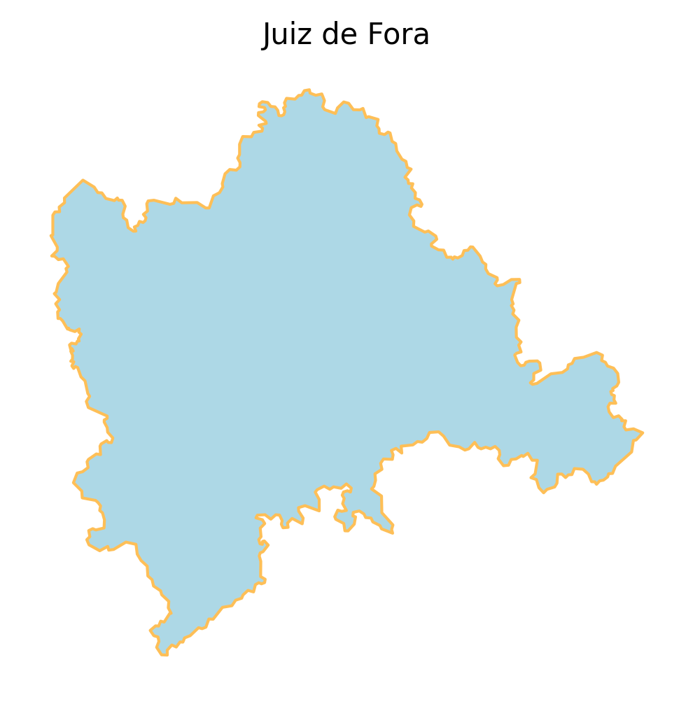
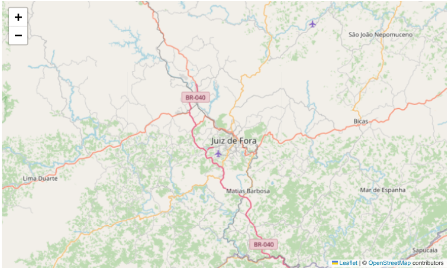
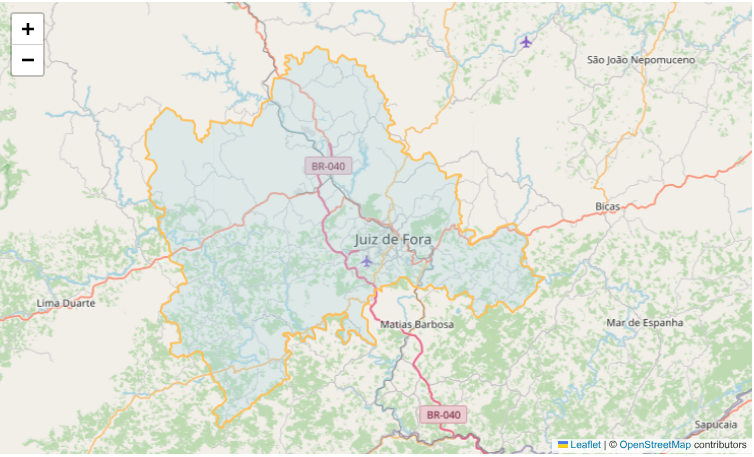
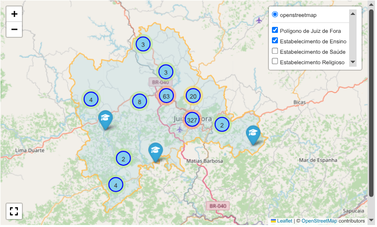

# Checagem de fatos com Python

### Introdução

<a href="https://g1.globo.com/mg/zona-da-mata/noticia/2024/02/03/juiz-de-fora-tem-mais-templos-religiosos-do-que-estabelecimentos-de-saude-e-de-ensino-juntos.ghtml" target="_blank">
    
</a>

Procuro casos reais para desenvolver as minhas habiidades em análise de dados, evitando exemplos tradicionais, sempre que possível. Quando me deparei com a [manchete](https://g1.globo.com/mg/zona-da-mata/noticia/2024/02/03/juiz-de-fora-tem-mais-templos-religiosos-do-que-estabelecimentos-de-saude-e-de-ensino-juntos.ghtml) sobre Juiz de Fora, cometi um viés de interpretação: concentrei-me apenas na quantidade de templos religiosos, ignorando que o foco da notícia seria a comparação com estabelecimentos de saúde e educação.

Como tentativa de reparação, implementei novas rotinas para efetivamente colocar na balança os dois grupos da comparação.

### Coleta de dados

Para baixar e processar o **CNEFE** - *Cadastro Nacional de Endereços para Fins Estatísticos* do IBGE, utilizamos o roteiro disponível no [GitHub](https://github.com/guiajf/igrejas).

### Importamos as bibliotecas


```python
import geobr
import folium
import matplotlib.pyplot as plt
import pandas as pd
import geopandas as gpd
from folium.plugins import MarkerCluster, Fullscreen
import zipfile

%matplotlib inline
```

### Extraímos os dados


```python
with zipfile.ZipFile('3136702_JUIZ_DE_FORA.zip') as z:
    with z.open('3136702_JUIZ_DE_FORA.csv') as f:
        chunks = pd.read_csv(f, 
                            sep=';',
                            chunksize=10000,
                            usecols=['COD_ESPECIE',
                                     'COD_SETOR', 
                                     'DSC_ESTABELECIMENTO', 
                                     'LATITUDE', 'LONGITUDE',
                                     'NOM_TIPO_SEGLOGR',
                                     'NOM_TITULO_SEGLOGR',
                                     'NOM_SEGLOGR',
                                     'NUM_ENDERECO',
                                     'NOM_COMP_ELEM1',
                                     'VAL_COMP_ELEM1',
                                     'NOM_COMP_ELEM2',
                                     'VAL_COMP_ELEM2',
                                     'NOM_COMP_ELEM3',   
                                     'VAL_COMP_ELEM3',                                        
                                     'CEP',
                                     'DSC_LOCALIDADE',
                                     'COD_INDICADOR_ESTAB_ENDERECO'])
        
        # Carregar todos os dados das categorias 4, 5 e 8
        filtered_data = pd.concat([
            chunk[chunk['COD_ESPECIE'].isin([4, 5, 8])] 
            for chunk in chunks
        ])

# Criar coluna END com todos os complementos
def formatar_endereco_completo(row):
    # Parte básica do endereço
    partes_logradouro = []
    
    if pd.notna(row['NOM_TIPO_SEGLOGR']):
        partes_logradouro.append(row['NOM_TIPO_SEGLOGR'])
    if pd.notna(row['NOM_TITULO_SEGLOGR']):
        partes_logradouro.append(row['NOM_TITULO_SEGLOGR'])
    if pd.notna(row['NOM_SEGLOGR']):
        partes_logradouro.append(row['NOM_SEGLOGR'])
    
    logradouro = ' '.join(partes_logradouro)
    endereco_base = f"{logradouro}, {row['NUM_ENDERECO']}"
    
    # Adicionar complementos se existirem
    complemento = ""

    # Primeiro complemento
    if pd.notna(row['NOM_COMP_ELEM1']) and pd.notna(row['VAL_COMP_ELEM1']):
        complemento += f" - {row['NOM_COMP_ELEM1']} {row['VAL_COMP_ELEM1']}"
    elif pd.notna(row['NOM_COMP_ELEM1']):
        complemento += f" - {row['NOM_COMP_ELEM1']}"
    elif pd.notna(row['VAL_COMP_ELEM1']):
        complemento += f" - {row['VAL_COMP_ELEM1']}"

    # Segundo complemento
    if pd.notna(row['NOM_COMP_ELEM2']) and pd.notna(row['VAL_COMP_ELEM2']):
        complemento += f" - {row['NOM_COMP_ELEM2']} {row['VAL_COMP_ELEM2']}"
    elif pd.notna(row['NOM_COMP_ELEM2']):
        complemento += f" - {row['NOM_COMP_ELEM2']}"
    elif pd.notna(row['VAL_COMP_ELEM2']):
        complemento += f" - {row['VAL_COMP_ELEM2']}"

    # Terceiro complemento
    if pd.notna(row['NOM_COMP_ELEM3']) and pd.notna(row['VAL_COMP_ELEM3']):
        complemento += f" {row['NOM_COMP_ELEM3']} {row['VAL_COMP_ELEM3']}"
    elif pd.notna(row['NOM_COMP_ELEM3']):
        complemento += f" {row['NOM_COMP_ELEM3']}"
    elif pd.notna(row['VAL_COMP_ELEM3']):
        complemento += f" {row['VAL_COMP_ELEM3']}"        
    
    endereco_completo = endereco_base + complemento
    
    # Limpar espaços extras
    return ' '.join(endereco_completo.split())

filtered_data['END'] = filtered_data.apply(formatar_endereco_completo, axis=1)

# Mapear códigos para nomes das categorias
categorias_nomes = {
    4: 'Estabelecimento de Ensino', 
    5: 'Estabelecimento de Saúde',
    8: 'Estabelecimento Religioso'
}

filtered_data['CATEGORIA_NOME'] = filtered_data['COD_ESPECIE'].map(categorias_nomes)
```

### Definimos o polígono do município

Para definir o polígono do município, utilizamos o pacote **geobr**, desenvolvido e mantido pela equipe do **IPEA** - *Instituto de Pesquisa Econômica Aplicada*, que disponibiliza funções para obter diversas bases de dados espaciais oficiais do Brasil.


```python
# Município de Juiz de Fora
jf = geobr.read_municipality(code_muni=3136702, year=2022)
```


```python
# Polígono de Juiz de Fora
fig, ax = plt.subplots(figsize=(4, 4), dpi=300)

jf.plot(facecolor="lightblue", edgecolor="#FEBF57", ax=ax)

ax.set_title("Juiz de Fora", fontsize=10)
ax.axis("off")
```


    (np.float64(-43.71289804999999),
     np.float64(-43.119688950000004),
     np.float64(-22.0230764),
     np.float64(-21.4966296))

   

    


### Sistema geodésico de referência

O **geobr** utiliza o sistema geodésico de referência *SIRGAS2000*, **CRS(ESPG 4674)**, oficialmente adotado pelo Brasil e, portanto, utilizado pelo **IBGE** por padrão.


```python
jf.crs
```


    <Geographic 2D CRS: EPSG:4674>
    Name: SIRGAS 2000
    Axis Info [ellipsoidal]:
    - Lat[north]: Geodetic latitude (degree)
    - Lon[east]: Geodetic longitude (degree)
    Area of Use:
    - name: Latin America - Central America and South America - onshore and offshore. Brazil - onshore and offshore.
    - bounds: (-122.19, -59.87, -25.28, 32.72)
    Datum: Sistema de Referencia Geocentrico para las AmericaS 2000
    - Ellipsoid: GRS 1980
    - Prime Meridian: Greenwich


### Características do objeto

O objeto **jf** é um GeoDataFrame que armazena dados geoespaciais. Sua coluna *geometry* contém a representação geográfica do município no formato **MULTIPOLYGON**.


```python
jf
```


<div>

<table border="1" class="dataframe">
  <thead>
    <tr style="text-align: right;">
      <th></th>
      <th>code_muni</th>
      <th>name_muni</th>
      <th>code_state</th>
      <th>abbrev_state</th>
      <th>name_state</th>
      <th>code_region</th>
      <th>name_region</th>
      <th>geometry</th>
    </tr>
  </thead>
  <tbody>
    <tr>
      <th>419</th>
      <td>3136702.0</td>
      <td>Juiz de Fora</td>
      <td>31.0</td>
      <td>MG</td>
      <td>Minas Gerais</td>
      <td>3.0</td>
      <td>Sudeste</td>
      <td>MULTIPOLYGON (((-43.26254 -21.74388, -43.25751...</td>
    </tr>
  </tbody>
</table>
</div>


```python
jf.info()
```

    <class 'geopandas.geodataframe.GeoDataFrame'>
    Index: 1 entries, 419 to 419
    Data columns (total 8 columns):
     #   Column        Non-Null Count  Dtype   
    ---  ------        --------------  -----   
     0   code_muni     1 non-null      float64 
     1   name_muni     1 non-null      object  
     2   code_state    1 non-null      float64 
     3   abbrev_state  1 non-null      object  
     4   name_state    1 non-null      object  
     5   code_region   1 non-null      float64 
     6   name_region   1 non-null      object  
     7   geometry      1 non-null      geometry
    dtypes: float64(3), geometry(1), object(4)
    memory usage: 72.0+ bytes


```python
print(jf.geometry.geom_type)
```

    419    MultiPolygon
    dtype: object


## Criamos o mapa básico

Utilizamos **Folium**, biblioteca Python para visualização de dados geoespaciais, que funciona como uma interface para a biblioteca *JavaScript* *Leaflet.js*.


```python
# Calcular centro do mapa baseado em todas as coordenadas válidas
valid_coords = filtered_data.dropna(subset=['LATITUDE', 'LONGITUDE'])
map_center = [valid_coords['LATITUDE'].mean(), valid_coords['LONGITUDE'].mean()]

m = folium.Map(location=map_center, zoom_start=10, tiles='OpenStreetMap')
m
```





### Adicionamos o polígono como uma camada json

Convertemos o polígono do município para o sistema geodésico de referência **ESPSG:4326 (WGS84)**, padrão de entrada do **Folium** para representar camadas vetoriais.


```python
# Adicionar polígono como uma camada json
jf_geojson = jf.to_crs(epsg=4326).to_json()

folium.GeoJson(
    jf_geojson,
    name='Polígono de Juiz de Fora',  # Nome que aparecerá no controle
    style_function=lambda x: {
        'fillColor': 'lightblue',
        'color': '#FEBF57',
        'weight': 2,
        'fillOpacity': 0.3
    },
    tooltip='Juiz de Fora'
).add_to(m)
m
```





### Definimos as camadas


```python

# Criar FeatureGroup com MarkerCluster para cada categoria
feature_groups = {}
marker_clusters = {}
cores = {
    4: 'blue',     # Ensino - azul
    5: 'red',      # Saúde - vermelho
    8: 'purple'    # Religioso - roxo
}

icones = {
    4: 'graduation-cap',    # Ensino
    5: 'medkit',           # Saúde
    8: 'pray'              # Religioso
}

# Configurações de estilo para os clusters
cluster_styles = {
    4: {'color': 'blue', 'fillColor': '#87CEEB'},     # Azul claro
    5: {'color': 'red', 'fillColor': '#FFB6C1'},      # Vermelho claro
    8: {'color': 'purple', 'fillColor': '#DDA0DD'}    # Roxo claro
}

for codigo, nome in categorias_nomes.items():
    # Criar FeatureGroup para a categoria
    feature_groups[codigo] = folium.FeatureGroup(
        name=nome, 
        show=False  # Inicia com todas as categorias ocultas
    )
    
    # Criar MarkerCluster para a categoria com configurações personalizadas
    marker_clusters[codigo] = MarkerCluster(
        name=f"{nome} - Cluster",
        options={
            'maxClusterRadius': 50,
            'disableClusteringAtZoom': 18,
            'spiderfyOnMaxZoom': True,
            'showCoverageOnHover': True,
            'zoomToBoundsOnClick': True,
            'chunkedLoading': True  # Melhora performance para grandes datasets
        },
        icon_create_function=f"""
        function(cluster) {{
            var count = cluster.getChildCount();
            var size = count < 10 ? 'small' : count < 50 ? 'medium' : 'large';
            var color = '{cluster_styles[codigo]['color']}';
            var fillColor = '{cluster_styles[codigo]['fillColor']}';
            return new L.DivIcon({{
                html: '<div style="background-color:' + fillColor + '; border: 2px solid ' + color + '"><span>' + count + '</span></div>',
                className: 'marker-cluster marker-cluster-' + size,
                iconSize: new L.Point(40, 40)
            }});
        }}
        """
    )
    
    # Adicionar o cluster ao FeatureGroup
    marker_clusters[codigo].add_to(feature_groups[codigo])
    
    # Adicionar o FeatureGroup ao mapa
    m.add_child(feature_groups[codigo])

# Adicionar marcadores aos respectivos MarkerClusters
for idx, row in valid_coords.iterrows():
    categoria = row['COD_ESPECIE']
    
    # Criar ícone personalizado para cada categoria
    icon = folium.Icon(
        icon=icones[categoria],
        prefix='fa',
        color=cores[categoria],
        icon_color='white'
    )
    
    # Criar popup informativo
    popup_text = f"""
    <div style="min-width: 250px;">
        <h4 style="margin: 0; color: {cores[categoria]};">{row['DSC_ESTABELECIMENTO']}</h4>
        <hr style="margin: 5px 0;">
        <p style="margin: 2px 0;"><b>Categoria:</b> {row['CATEGORIA_NOME']}</p>
        <p style="margin: 2px 0;"><b>Endereço:</b> {row['END']}</p>
        <p style="margin: 2px 0;"><b>Localidade:</b> {row['DSC_LOCALIDADE']}</p>
        <p style="margin: 2px 0;"><b>CEP:</b> {row['CEP']}</p>
        <p style="margin: 2px 0;"><b>Setor:</b> {row['COD_SETOR']}</p>
    </div>
    """
    
    # Criar marcador
    marker = folium.Marker(
        location=[row['LATITUDE'], row['LONGITUDE']],
        popup=folium.Popup(popup_text, max_width=300),
        icon=icon,
        tooltip=f"{row['DSC_ESTABELECIMENTO']}"
    )
    
    # Adicionar marcador ao cluster da categoria
    marker.add_to(marker_clusters[categoria])

# Adicionar plugin de tela cheia
fullscreen_plugin = Fullscreen(
    position='bottomleft',
    title='Expandir tela',
    title_cancel='Sair da tela cheia',
    force_separate_button=True
).add_to(m)

# Adicionar controle de camadas
folium.LayerControl(collapsed=False).add_to(m)

# Adicionar título ao mapa
title_html = '''
             <h3 align="center" style="font-size:16px"><b>Estabelecimentos: Ensino/Saúde/Religioso - Juiz de Fora</b></h3>
             <p align="center">Selecione a(s) categoria(s)</p>
             '''
m.get_root().html.add_child(folium.Element(title_html))

# Exibir o mapa
display(m)
```




### Confirmamos as premissas da manchete


```python
# 4. Exibir estatísticas por categoria
print("=== ESTATÍSTICAS POR CATEGORIA ===")
estatisticas = filtered_data['CATEGORIA_NOME'].value_counts()
total_estabelecimentos = len(filtered_data)

for categoria, quantidade in estatisticas.items():
    percentual = (quantidade / total_estabelecimentos) * 100
    print(f"• {categoria}: {quantidade} estabelecimentos ({percentual:.1f}%)")

print(f"\nTotal de estabelecimentos mapeados: {total_estabelecimentos}")
```

    === ESTATÍSTICAS POR CATEGORIA ===
    • Estabelecimento Religioso: 1305 estabelecimentos (54.2%)
    • Estabelecimento de Saúde: 665 estabelecimentos (27.6%)
    • Estabelecimento de Ensino: 439 estabelecimentos (18.2%)
    
    Total de estabelecimentos mapeados: 2409


```python

```

**Considerações finais**

No mapa interativo, selecione uma categoria e ajuste o zoom para visualizar a quantidade de estabelecimentos por tipo. Os dados tabulares confirmam que os estabelecimentos religiosos representam mais de 50% da amostra.


```python

```

**Referências**

Ferreira, G. (2025). *Distribuição de estabelecimentos religiosos por setores censitários*. Disponível em: https://github.com/guiajf/igrejas

Lopes, G., Delbem, A. et. all (2021). *Introdução à Análise de Dados Geoespaciais com
Python* In *Minicursos  do  XIV  Encontro  Unificado  de  Computação  do Piauí (ENUCOMPI) e XI Simpósio de Sistemas de Informação (SINFO)* [recurso eletrônico] –organizadores: Antonio Oseas de Carvalho  Filho,  Deborah  Maria  Vieira  Magalhães,  Rodrigo Augusto  Rocha  Souza  Baluz,Romuere  Rodrigues  Veloso  e Silva. –Porto Alegre : SBC, 2021. Disponível em: https://books-sol.sbc.org.br/index.php/sbc/catalog/view/76/327/583

Pereira, R.H.M.; Gonçalves, C.N.; et. all (2019) geobr: Loads Shapefiles of Official Spatial Data Sets of Brazil. GitHub repository - https://github.com/ipeaGIT/geobr

Python 3.14.0 Documentation » The Python Standard Library » Text Processing Services » re — Regular expression operations. Last updated on Oct 12, 2025 (12:31 UTC). Disponível em: https://docs.python.org/3/library/re.html#regular-expression-syntax


```python

```
